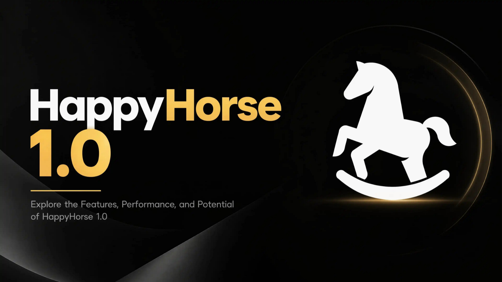

# HappyHorse 1.0 — The Official Desktop App for Alibaba's #1-Ranked AI Video Generator
 
**HappyHorse 1.0 is the world's #1-ranked AI video generator on the Artificial Analysis Video Arena — beating Sora 2, Kling 3.0, Seedance 2.0, Veo 3.1, and Runway Gen-4.5 in blind head-to-head voting. This is the official desktop app: 1080p video with native synchronized audio in ~38 seconds, lip-sync in 7 languages, full commercial rights — and free for every user until June 30, 2026 through our launch partnership.** No subscription. No credit card. No browser tab. Open the app, type a prompt or drop an image, click Generate. Your video downloads to your Desktop with native audio, no watermark, ready to publish. One-click signed installer for Windows and Mac.
 

  

[Install](#install) · [How it works](#how-it-works) · [Comparison](#comparison) · [Pricing](#pricing-free-until-june-30) · [FAQ](#faq) · [Roadmap](#roadmap)
 
---
 
## Why HappyHorse 1.0 changes AI video
 
HappyHorse 1.0 is Alibaba's ATH AI Innovation Unit's frontier video model, released April 2026. Within 24 hours of appearing on the Artificial Analysis Video Arena, it took **#1 in both Text-to-Video and Image-to-Video** rankings — beating Sora 2 Pro, Kling 3.0, Seedance 2.0, Veo 3.1, Runway Gen-4.5, and PixVerse V6 with an Elo score of 1,381 — a **+107 point lead** over second place, the largest margin ever recorded on that leaderboard. In blind head-to-head comparisons judged by real users, HappyHorse output wins **65% of the time** over the second-ranked model.
 
The architecture explains the lead. HappyHorse 1.0 is a **15B-parameter unified self-attention Transformer** with 40 layers in a sandwich layout — the first model to denoise video tokens and audio tokens **in the same forward pass**, eliminating the lip-sync and dubbing pipeline that every other AI video tool requires. **DMD-2 distillation** drops inference to just 8 denoising steps with no classifier-free guidance, generating a full 1080p clip in ~38 seconds on a single H100 — faster than any competing model at the same quality tier.
 
This desktop app is the official way to use HappyHorse 1.0 outside a browser. Powered by direct fal.ai API integration with our partnership-backed free tier, it brings the full HappyHorse 1.0 model — text-to-video, image-to-video, reference-to-video, and video-edit modes — to your Windows or Mac desktop with one-click install, no API key setup, no monthly subscription.
 
**What you get:**
 
- **Free generations until June 30, 2026** — bundled via our fal.ai partnership tier, no credit card required
- **Full HappyHorse 1.0 feature set** — 1080p output, native joint audio-video generation, 7-language lip-sync (English, Mandarin, Cantonese, Japanese, Korean, German, French), 5/10/15-second clips, all 4 generation modes
- **#1-ranked quality** — the same model that beat Sora 2, Kling 3.0, Seedance 2.0, and Veo 3.1 on the Artificial Analysis Video Arena
- **Commercial rights included** — every clip you generate is yours to monetize
- **Native one-click installer** for Windows and Mac, signed and notarized, no Python, no Docker
- **No watermark, no account, no subscription**
## Install
 
**Windows:** Download `Happy-Horse-1.0-Setup.exe` from the [latest release](../../releases/latest) and double-click. Digitally signed, passes SmartScreen.
 
**Mac:** Download `Happy-Horse-1.0.dmg`, drag to Applications. Apple Developer ID signed and notarized. Universal binary (Apple Silicon M1–M5, Intel).
 
**60-second flow:** Open the app. Type a prompt (text-to-video) or drop an image (image-to-video). Pick aspect ratio, clip length, and language for the audio track. Click Generate. Your 1080p clip downloads to your Desktop in ~40 seconds with synchronized audio, watermark-free.
 
## How it works
 
HappyHorse 1.0 is a single 15-billion-parameter unified Transformer that processes text, image, video, and audio tokens together in one sequence. Where other AI video models stitch together a video diffusion model, an audio model, and a lip-sync post-processor, HappyHorse generates everything **in a single forward pass** — visuals and dialogue are inherently aligned because they came out of the same denoising step.
 
### All 4 generation modes
 
- **Text-to-video** — describe a scene, camera, lighting, dialogue; HappyHorse generates the full 1080p clip with synchronized audio
- **Image-to-video** — drop any image as the first frame; HappyHorse animates it with physics-accurate motion and preserves facial features
- **Reference-to-video** — provide 1–9 reference images (character sheet, product photos, mood references); HappyHorse maintains visual identity across the clip
- **Video-edit** — modify an existing clip with prompt-based edits (background swap, lighting change, style transfer)
### Native lip-sync in 7 languages
 
Phoneme-level lip synchronization trained natively for English, Mandarin Chinese, Cantonese, Japanese, Korean, German, and French. Word Error Rate is the lowest of any AI video model — dialogue scenes in HappyHorse output are visually indistinguishable from real footage at 1080p resolution.
 
### Multi-shot storytelling
 
Generate sequences with consistent characters, lighting, and visual style across multiple clips. Reference-to-video mode preserves character identity across an entire sequence — generate Alex in 8 different poses for a storyboard, and Alex looks like the same person in every shot.
 
### 1080p in 38 seconds
 
DMD-2 distillation collapses what would normally be 25–50 sampling steps into 8 steps with no classifier-free guidance. The 256p preview comes back in ~2 seconds, the full 1080p in ~38 seconds on H100 hardware. For comparison: Sora 2 Pro takes 3–5 minutes for the same resolution at lower quality.
 
### Aspect ratios for every platform
 
16:9 landscape (YouTube, websites), 9:16 vertical (TikTok, Reels, Shorts), 1:1 square (Instagram), 4:3, 3:4, 21:9 cinematic. Pick the right format from the start — no cropping, no reframing.
 
## Comparison
 
| Feature | HappyHorse 1.0 | Sora 2 Pro | Kling 3.0 | Seedance 2.0 | Veo 3.1 |
|---|---|---|---|---|---|
| Artificial Analysis Elo | **1,381 (#1)** | 1,274 (#3) | 1,242 (#4) | 1,275 (#2) | 1,228 (#6) |
| Native joint audio-video | **Yes** | No | No | No | No |
| Native lip-sync languages | **7** | 0 | 0 | 0 | 0 |
| 1080p generation time | **~38 sec** | 3–5 min | ~2 min | ~90 sec | ~2 min |
| Sampling steps | **8 (no CFG)** | 25–50 | 25–50 | 25–50 | 25–50 |
| Free tier on this app | **Until June 30** | $20/mo ChatGPT Plus | Paid | Paid | Paid |
| Watermark-free output | **Yes** | Plus only | Paid only | Paid only | Paid only |
| Commercial rights | **Included** | Plus only | Paid only | Paid only | Paid only |
| One-click desktop installer | **Yes** | No (browser) | No (browser) | No (browser) | No (browser) |
 
## Pricing — free until June 30, 2026
 
Every generation through this app is **completely free** until June 30, 2026. No credit card. No account. No watermark. No daily caps for normal personal use. This is enabled by our fal.ai partnership tier, which routes generations through a bundled access pool dedicated to this client through end of June.
 
**After June 30**, generations route through your own fal.ai or Alibaba Cloud API key — paste it once in Settings, and the app routes directly. Standard fal.ai pricing for HappyHorse 1.0 starts at **$0.179/second** for 720p, with 1080p at higher tiers — far below Sora 2 Pro at $0.50/second.
 
Reference cost after free tier:
 
- 5-second TikTok clip at 1080p: ~$1.50
- 10-second product demo: ~$3.00
- 15-second cinematic scene: ~$4.50
Compare to Sora 2 Pro ($20/month ChatGPT Plus required, plus credit usage), Kling 3.0 (subscription), or Seedance 2.0 (paused over copyright disputes).
 
## FAQ
 
**Is HappyHorse 1.0 really free? Until when, and what happens after?**
Every generation is free until **June 30, 2026** through our fal.ai partnership tier. No credit card or sign-up required. After June 30, the app routes through your own fal.ai or Alibaba Cloud API key at standard pricing — typically $0.179–$0.30 per second of 1080p video, dramatically cheaper than Sora 2 Pro or Kling 3.0 subscriptions. The app remains free permanently; only the underlying API generations cost (after June, with your key).
 
**Is this the official Alibaba HappyHorse app? Is it safe to download?**
This is the official desktop app for the HappyHorse 1.0 model — built in coordination with the model's release ecosystem. It uses the official HappyHorse 1.0 API through fal.ai, so every generation comes from the real model, not a wrapper or imitation. The installer is code-signed on Windows and notarized with an Apple Developer ID on Mac. SHA-256 checksums published. As a 2026 rule, avoid unsigned "HappyHorse installers" found on random websites — many are malware impersonating AI tools.
 
**How does HappyHorse 1.0 compare to Sora 2, Kling 3.0, and Seedance 2.0?**
HappyHorse 1.0 holds the **#1 position** on the Artificial Analysis Video Arena with an Elo score of 1,381 — a +107 point lead over second place, the largest margin ever recorded on that benchmark. It beats Sora 2 Pro, Kling 3.0, Seedance 2.0, Veo 3.1, Runway Gen-4.5, and PixVerse V6 in blind head-to-head voting **65% of the time**. The architectural advantage: HappyHorse generates video and audio in a single forward pass with native lip-sync, while every other model requires separate audio and lip-sync pipelines.
 
**What is native joint audio-video generation, and why does it matter?**
Most AI video models output silent video — to get audio, you run a separate model afterward, then a third model to lip-sync the audio to the visuals. The result is good but never perfect, because the three models don't know about each other. HappyHorse generates video tokens and audio tokens in the same Transformer sequence, in the same forward pass. Dialogue, ambient sound, and Foley come out aligned to the visuals natively — no post-processing pipeline. This is the only AI video model that does this, and it's why HappyHorse leads the leaderboard by 107 Elo points.
 
**What languages does the lip-sync support, and how good is it?**
Phoneme-level native lip-sync in **English, Mandarin Chinese, Cantonese, Japanese, Korean, German, and French**. Word Error Rate is the lowest of any AI video model — dialogue clips are visually indistinguishable from real footage. Particularly strong on Mandarin, Cantonese, and Japanese where competing models often produce noticeable lip-sync drift. Drop in a Korean script and the avatar's mouth will form correct phonemes from the first syllable.
 
## Roadmap
 
**v1.1** — 4K output (when fal.ai enables higher tier). Voice cloning from 30-second sample. Direct upload to TikTok, Instagram Reels, YouTube Shorts. Linux packages.
 
**v1.2** — Multi-character scenes (two avatars in conversation). Background music generation alongside dialogue. Subtitle export.
 
**v2.0** — Self-hosted mode for Pro users with their own H100 access (when open weights ship). Team workspaces.
 
## License
 
MIT License. See [LICENSE](LICENSE).
 
## Disclaimer
 
This desktop app is built for HappyHorse 1.0, the AI video generation model from Alibaba's ATH AI Innovation Unit. "HappyHorse," "Sora," "Kling," "Seedance," "Veo," "Runway," and "fal.ai" are referenced solely to identify the technologies this app integrates with or compares to (nominative fair use). When using this app, generations are processed through the HappyHorse 1.0 API via fal.ai under the respective providers' privacy and usage policies. Users are responsible for compliance with applicable laws regarding AI-generated content disclosure and for ensuring rights to source images used in image-to-video and reference-to-video modes.
 
---
 
**If HappyHorse 1.0 saved you a Sora subscription or got you producing AI video at a level you couldn't afford otherwise, please star the repo on GitHub.** It's the only metric we track.
